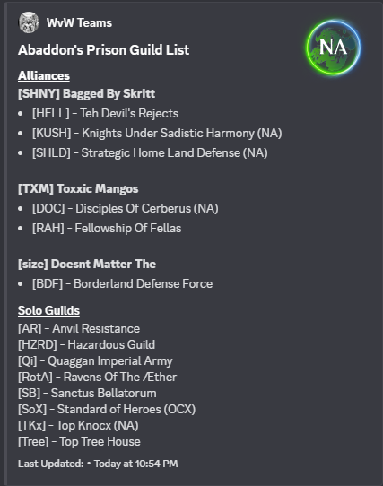

# GW2-WVW-Teams

A utility to build **Discord embeds** for Guild Wars 2 World vs. World teams.  
It organizes data by **World IDs**, **Alliances**, **Alliance Guilds**, and **Solo Guilds**, then posts the results to a Discord channel via webhook.

---

## How It Works
- Reads `.csv` exports of the **`Alliances`** and **`SoloGuilds`** worksheets from the official **WvW Guilds Google Sheet**.  
  *(Example CSV exports are included in this repository.)*
- Assumes the Google Sheet is up to date with the latest alliance changes and world ID mappings.
- Data is loaded into **Pandas DataFrames**, processed per world, and formatted into Discord embeds.
- Embeds are then sent to the configured **Discord webhook** in your server.
- (Optional) A helper function is included to fetch a world ID automatically based on an alliance guild ID, if you need more automation.

---

## Setup

1. **Configure Discord Settings**  
   Edit `config.ini` with your server details:
   ```ini
   [discord]
   WEBHOOK_URL = https://discord.com/api/webhooks/your_webhook_id/your_webhook_token
   GUILD_ID = 123456789012345678
    ```

    To find your `GUILD_ID`, copy a message link from the target channel.
    The link format looks like this:

    ```
    https://discord.com/channels/<guild_id>/<channel_id>/<message_id>
    ```

2. **Install Dependencies**
   Make sure you have Python 3.9+ installed, then install requirements:

   ```bash
   pip install -r requirements.txt
   ```

3. **Prepare CSV Data**
   Export the latest worksheets from the **WvW Guilds Google Sheet**:

   * `Alliances` → `WvW Guilds - Alliances.csv`
   * `SoloGuilds` → `WvW Guilds - SoloGuilds.csv`

   Place both files in the same directory as `wvw-teams.py`.
   *(These filenames are the defaults when exporting from Google Sheets.)*

---

## Usage

1. Open a terminal and navigate to the script’s directory.
2. Run:
    ```
    python wvw-teams.py
    ```


    The script will process the CSV files, build embeds for each world, and post them to your Discord server.

    Example Output:

    [] []


## Requirements

* Python 3.9+
* [requests](https://pypi.org/project/requests/)
* [pandas](https://pypi.org/project/pandas/)

Install all dependencies with:

    
    pip install -r requirements.txt
    


## Notes

* This is currently a **prototype**. Improvements such as automatic Google Sheet integration and error handling may be added later.
* Contributions and feedback are welcome!